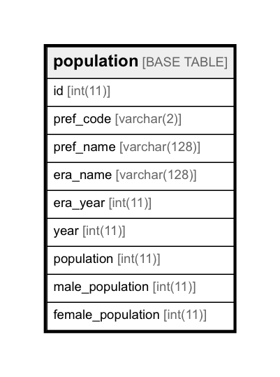

# population

## Description


<details>
<summary><strong>Table Definition</strong></summary>

```sql
CREATE TABLE `population` (
  `id` int(11) NOT NULL AUTO_INCREMENT,
  `pref_code` varchar(2) NOT NULL,
  `pref_name` varchar(128) NOT NULL,
  `era_name` varchar(128) NOT NULL,
  `era_year` int(11) NOT NULL,
  `year` int(11) NOT NULL,
  `population` int(11) NOT NULL,
  `male_population` int(11) NOT NULL,
  `female_population` int(11) NOT NULL,
  PRIMARY KEY (`id`)
) ENGINE=InnoDB AUTO_INCREMENT=981 DEFAULT CHARSET=utf8
```

</details>


## Columns

| Name | Type | Default | Nullable | Children | Parents | Comment |
| ---- | ---- | ------- | -------- | -------- | ------- | ------- |
| id | int(11) |  | false |  |  |  |
| pref_code | varchar(2) |  | false |  |  |  |
| pref_name | varchar(128) |  | false |  |  |  |
| era_name | varchar(128) |  | false |  |  |  |
| era_year | int(11) |  | false |  |  |  |
| year | int(11) |  | false |  |  |  |
| population | int(11) |  | false |  |  |  |
| male_population | int(11) |  | false |  |  |  |
| female_population | int(11) |  | false |  |  |  |

## Constraints

| Name | Type | Definition |
| ---- | ---- | ---------- |
| PRIMARY | PRIMARY KEY | PRIMARY KEY (id) |

## Indexes

| Name | Definition |
| ---- | ---------- |
| PRIMARY | PRIMARY KEY (id) USING BTREE |


## Relations



---

> Generated by [tbls](https://github.com/k1LoW/tbls)